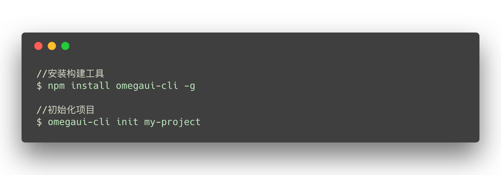
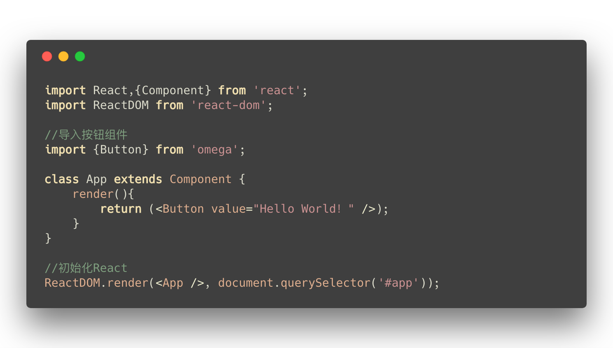
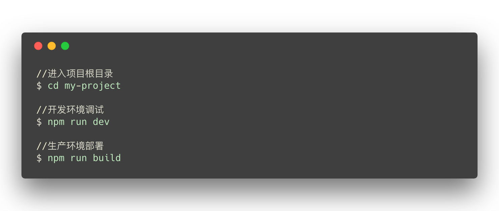

  

------

      

 Responsive Bootstrap Admin & Powerful UI Kit By [React](http://facebook.github.io/react/).

## 快速构建

推荐使用快速构建工具  `Omegaui-CLI`  搭建项目，只需依次执行：
 
> 构建工具具体用法清参考[构建工具说明](https://github.com/qulongjun/Omega-cli)。

## 使用示例

以下是一个组件的简单使用示例, **你只需做如下事情**:

>  我们提供了丰富的组件供开发者使用，可以访问[官方示例](https://omega-qulongjun.com)查看具体实现。

## 调试与部署

快速构建工具已经集成了一键式调试与部署指令，只需执行如下命令即可实现开发环境下的调试和生产环境的部署：

>  开发环境下启动调试后，在浏览器中打开 [http://127.0.0.1:8080](http://127.0.0.1:8080) 查看效果。

## 获取帮助
如果您在使用的过程中碰到问题，可以通过下面几个途径寻求帮助：
* 我们提供了详细的[说明文档](https://omega-doc.qulongjun.com)，大部分问题都可以在文档中得以解决。
* 利用强大的 [Issue](https://github.com/qulongjun/Omega-UI/issues) 功能，您可以直接进行提问，我们会随时关注并解答，同时我们也鼓励资深用户通过 Issue 给新人提供帮助。

## 参与项目

我们很期待您能参与进来一起开发。 :)

## License

本项目基于 MIT license 开源。