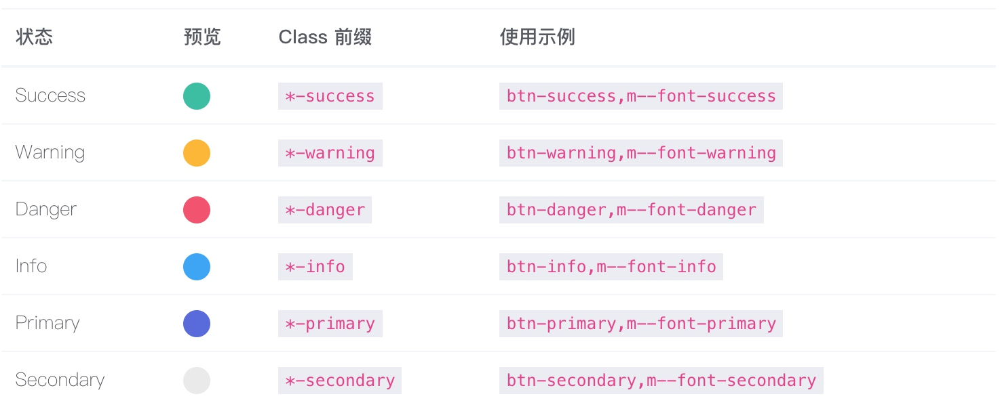

# 状态颜色
> 为了使整个应用程序的颜色统一， 简化开发流程，我们预设了数种符合现代化网页的状态颜色。

### Bootstrap 状态颜色
`Bootstrap` 设计了种类丰富的状态颜色，这些状态可以直接应用于绝大部分元素和组件。我们重新设计了 `Bootstrap` 自带的六种状态：

### 自定义状态颜色
与此同时，为了丰富用户使用，我们增加了一些特殊的状态颜色，例如 `Brand` 和 `Metal` 等。

