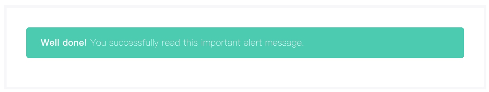
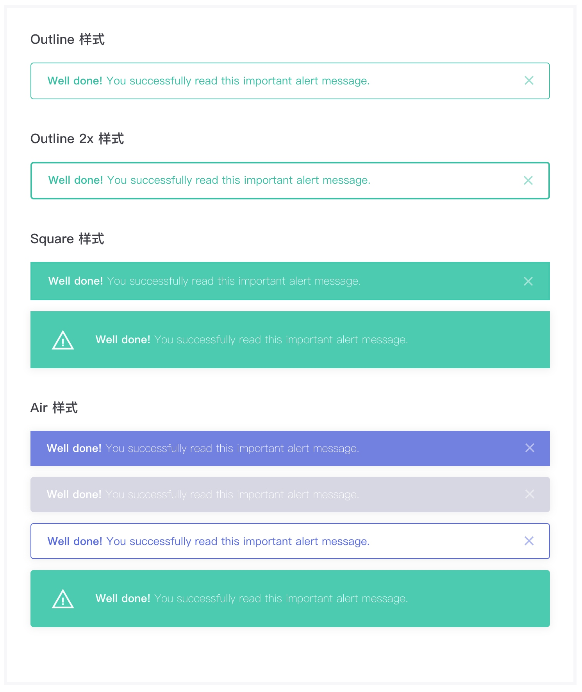

# 消息框组件
> 块级组件，显示一个带背景色的高亮矩形可交互区域。

### 语法
##### 私有参数

| 参数名 | 类型 | 默认值 | 描述
| :-: | :-: | :-: | :- |
| title | string | 空 | 设置消息框标题。|
| message | string | 空 | 设置消息框内容。|
| alertColor | string | 空 | 设置消息框背景色，参考 [状态颜色](../../ch1/stateColor.md)。|
| type | string/string | 空 | 设置消息框类型，支持的参数有 `outline` 、 `outline-2x`、`square`、`normal`。|
| closeBtn | bool | false | 设置消息框是否显示关闭图标。|
| icon | string | 空 | 设置消息框最左侧显示的图标。|
| iconStyle | string | regular | 设置消息框图标的显示样式，支持的参数有 `regular` 、`bold`。|
| actions | array | 空 | 设置消息框交互按钮，数组接受对象作为参数，对象配置见下文。|
| actionStyle | object | 空 | 设置消息框交互按钮外部容器样式。|

actions对象

| 参数名 | 类型  | 描述
| :-: | :-: | :- | 
| closeBtn | bool | 设置当前按钮是否为关闭按钮。|
>除了 `closeBtn` 属性之外，`item` 对象的其他属性完全继承自 [基础按钮组件](../button/baseButton.md) 。

##### 调用方式
``` jsx
import Alert from '@Alert';
<Alert {...{
    title:'Well done!',
    message:'You successfully read this important alert message.',
    closeBtn:false,
    alertColor:'success'
}}/>
```
##### 渲染结果
``` html
<div class="alert m-alert alert-success">
    <div class="m-alert__text">
        <strong>Well done!</strong> 
        You successfully read this important alert message.
    </div>
</div>
```

##### 实现效果


### 最佳实践
通过 [公共配置](../ch1/public.md)，组件可以实现丰富的样式和逻辑的控制。

##### 丰富的背景色
在实际业务中，我们可以使用不同背景色的消息框对用户进行相应的提示，例如：用户操作成功可以使用 `success` 状态的消息框，用户操作失败可以使用 `danger` 状态的颜色等。

 **代码示例：**
```js
{
    alertColor:'danger'
}
```

**实现效果：**


##### 消息框样式
为了统一应用程序中UI设计，消息框组件提供了四种样式可供选择
-  normal：以圆角矩形的样式显示。
- outline：以反色的样式显示。
- outline-2x：以反色边框加粗的样式显示。
- square：以直角矩形的样式显示。
- air：设置阴影效果。


 **代码示例：**
```js
{
    type:['outline','outline-2x']
}
```

**实现效果：**


