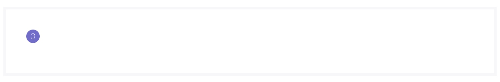
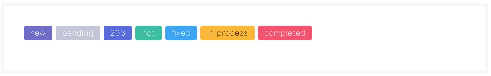

# 徽章组件
> 行间组件，显示一个带背景色的包含文本区域，用于突出显示某些文本，如未读数量等。

### 语法
##### 私有参数

| 参数名 | 类型 | 默认值 | 描述
| :-: | :-: | :-: | :- |
| bgColor | string | 空 | 设置徽章背景颜色，参考 [状态颜色](../../ch1/stateColor.md)。|
| inverse | bool | false | 设置徽章是否反色显示。|
| type | string/array | 空 | 设置徽章显示样式，支持的参数有 `square`、 `wide` 、 `rounded` 、 `dot` 、`dot-sm ` 、`normal`  。|

##### 调用方式
``` jsx
import Badge from '@Badge';
<Badge {...{
    bgColor:'brand'
}}>3</Badge>
```
##### 渲染结果
``` html
<span class="m-badge m-badge--brand">3</span>
```
##### 实现效果

### 最佳实践
通过 [公共配置](../ch1/public.md)，组件可以实现丰富的样式和逻辑的控制。
##### 徽章样式
通过 `type` 属性，我们可以便捷的控制徽章的显示样式。

**代码示例：**
```js
{
    type:'wide'
}
```

**实现效果：**

normal：

square：

dot、dot-sm：

wide：

rounded：



##### 反色
通过 `inverse` 属性，我们可以便捷的控制徽章以反色显示，即白色背景，边框存在颜色。

**代码示例：**
```js
{
    inverse:true
}
```

**实现效果：**


