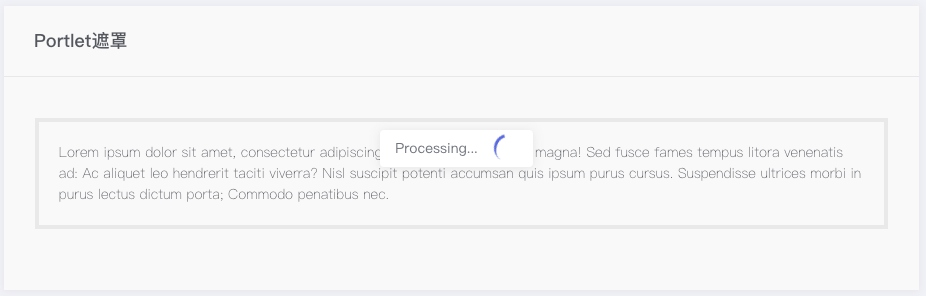

# 遮罩组件
> 块级组件，为外部容器增加一个带滚动圈的遮罩层，会阻止外部容器的交互，直到遮罩被取消。

### 语法
##### 私有参数

| 参数名 | 类型 | 默认值 | 描述
| :-: | :-: | :-: | :- |
| block | bool | true | 设置是否显示遮罩组件。|
| overlayColor | string | 空 | 设置遮罩层滚动圈颜色，。|
| message | string | 空 | 设置遮罩层显示消息。|
| el | string | 空 | 指定需要遮罩层的容器 。|

##### 调用方式
``` jsx
import BlockUI from '@BlockUI';
<Section>
    <BlockUI  {...{
        block:true
     }}>
        <Paragraph> ... </Paragraph>
    </BlockUI>
</Section>
```
##### 渲染结果
``` html
<div class="m-section__content">
    <div class="" style="position: relative; zoom: 1;">
        <p>...</p>
        <div class="blockUI" style="display:none"></div>
        <div class="blockUI blockOverlay" ></div>
        <div class="blockUI blockMsg blockElement" >
            <div class="m-loader  m-loader--brand m-loader--lg"></div>
        </div>
    </div>
</div>
```

##### 实现效果


### 最佳实践
通过 [公共配置](../ch1/public.md)，组件可以实现丰富的样式和逻辑的控制。
>你可以将遮罩层作用于任何外部块状容器，只需在该容器内部包含遮罩组件，或使用 `el` 属性指定容器。

##### 应用于 Portlet

**代码示例：**
```jsx
<Portlet>
    <BlockUI {...{
        ...
     }}>
        ....
    </BlockUI>
</Portlet>
```

**实现效果：**


##### 自定义容器

**代码示例：**
```js
// el 指定 id 属性为 block_1 的容器。
{
    el: '#block_1'
}
```
##### 页面遮罩

**代码示例：**
```js
// el 属性设置为body即可实现页面遮罩。
{
    el: 'body'
}
```