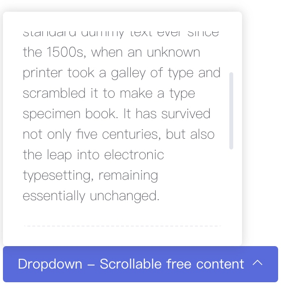

# 下拉组件
> 块级组件，显示一个可通过交互触发的下拉区域。

### 语法
##### 私有参数

| 参数名 | 类型 | 默认值 | 描述
| :-: | :-: | :-: | :- |
| toggle | string | click | 设置下拉列表交互方式，支持的参数有`click`、`hover`。|
| persistent | bool | false | 设置下拉组件在被点击后是否保留显示状态。|
| hoverTimeout | number | 300 | 设置在鼠标移出下拉组件后，组件销毁延时。|
| direction | string | left | 设置下拉组件对齐方式，支持的参数有 `left` 、 `right`、`center`。|
| showArrow | bool | true | 设置下拉组件是否显示指示箭头。|
| button | object | 空 | 设置触发下拉组件按钮的样式，参考 [按钮组件](../button/baseButton.md)。|
| vertical | bool | bottom | 设置下拉组件的弹出方向，支持的参数有 `top` 、 `bottom`。|

##### 调用方式
``` jsx
import {Dropdown} from 'omega';
<Dropdown {...{
    button:{
        value:'Dropdown',
        btnColor:'success'
   }
}}>
...
</Dropdown>
```
##### 渲染结果
``` html
<div class="m-dropdown m-dropdown--inline m-dropdown--arrow" m-dropdown-toggle="click">
    <a href="#" class="m-dropdown__toggle btn btn-success dropdown-toggle">Dropdown</a>
    <div class="m-dropdown__wrapper">
		<span class="m-dropdown__arrow m-dropdown__arrow--left"></span>
		<div class="m-dropdown__inner">
			<div class="m-dropdown__body">
			    <div class="m-dropdown__content">
                    ...                
                </div>
			</div>
		</div>
	</div>    
</div>
```

##### 实现效果


### 最佳实践
通过 [公共配置](../ch1/public.md)，组件可以实现丰富的样式和逻辑的控制。

##### 与其他组件配合
我们可以让下拉组件与其他组件配合，可以实现更丰富的交互，如下所示为与滚动组件配合：

 **代码示例：**
```jsx
<Dropdown {...{
    ...
}}>
    <Scroll>
        <Paragraph>
            //This is a long paragraph.
        </Paragraph>
    </Scroll>
</Dropdown>
```

**实现效果：**


