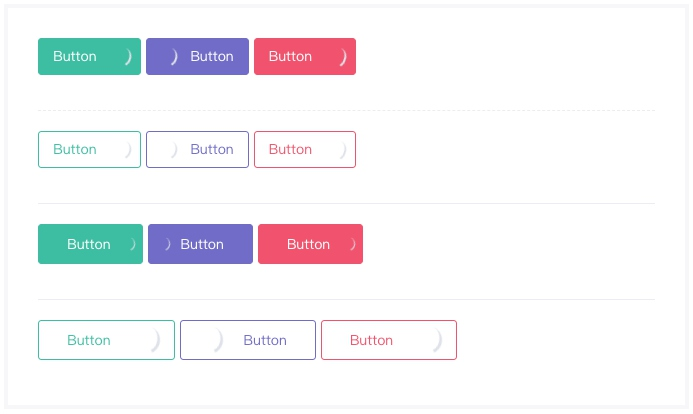

# 加载组件
> 行间组件，在指定位置添加一个不断旋转的加载滚动条。

### 语法
##### 私有参数

| 参数名 | 类型 | 默认值 | 描述
| :-: | :-: | :-: | :- |
| color | string | 空 | 设置加载条的滚动颜色，参考 [状态颜色](../../ch1/stateColor.md)。|
| size | string | normal | 设置加载条的尺寸，支持的参数有 `sm` 、`lg` 、`normal` 。|
| align | string | center | 设置加载条的位置，支持的参数有 `left` 、`right` 、`center` 。|
| width | string | 30px | 设置加载条外部容器的宽度 。|

##### 调用方式
``` jsx
import Loader from '@Loader';
<Loader {...{
    color:'brand',
    width:'30px'
}}/>
```
##### 渲染结果
``` html
<div class="m-loader m-loader--brand" style="width: 30px; ">
</div>
```

##### 实现效果


### 最佳实践
通过 [公共配置](../ch1/public.md)，组件可以实现丰富的样式和逻辑的控制。

##### 按钮加载
加载组件通常与其他组件配合使用，以按钮组件为例，当需要实现点击按钮之后进行响应等待业务需求时，可以使用按钮加载。

**代码示例：**
```jsx
<Button {...{
    label:'a',
    btnColor:'success',
    value:'Button',
    loader:{
      show:true,
      align:'right'
  }
}}/>
```

**实现效果：**


