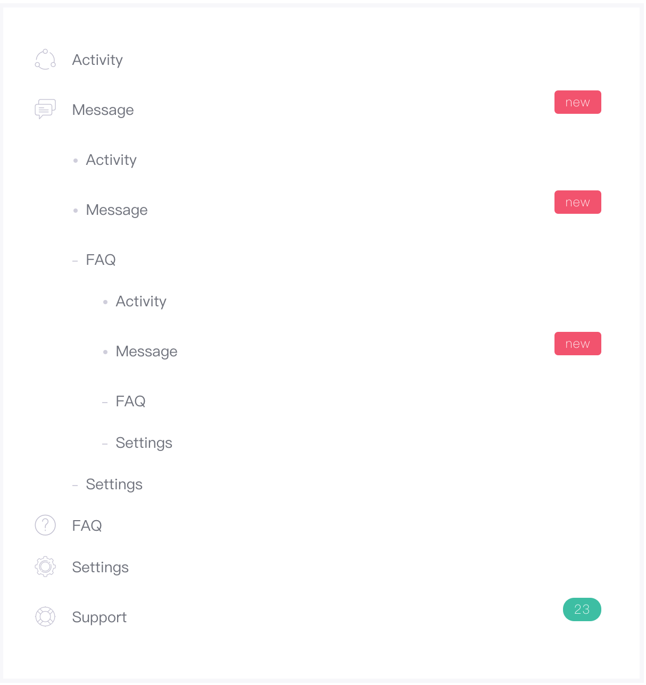

# 导航组件
> 块级组件，导航栏在您的应用或网站中作为导航页头的响应式基础组件。

### 语法
##### 私有参数

| 参数名 | 类型 | 默认值 | 描述
| :-: | :-: | :-: | :- |
| type | string | default | 设置导航组件的类型，支持的参数有：`default`（块状导航）、`inline`（行间导航）、`sub`（导航标题）。|
| items | array | 空 | 设置导航项，具体配置见下文。|

##### `items`参数
| 参数名 | 类型 | 描述
| :-: | :-: | :- |
| type  | string  |  当前导航项类型，支持的参数有 `section`（分段）、`separator`（分割线）、`other`（自定义导航）、`default`（默认链接） 。 |
| text  | object | 导航项文本内容，属性配置见下文。 |
| icon  | object | 菜单项图标显示，相关配置见下文。 |
| badge  | Component | 菜单项徽章显示，参数为[徽章组件](./badge.md) 实例。  |
| bullet  | object | 菜单项列表显示前缀，相关配置见下文。 |
| state | string | 设置导航项当前状态，支持的参数有 `active`、`disabled` |

##### `text` 对象参数
| 参数名 | 类型 | 描述
| :-: | :-: | :- |
| value | string | 设置导航项显示文本。 |
| href | string | 设置导航项链接 URI。 |
| child | Component | 设置子导航，接受导航组件实例作为值。 |

##### `icon` 对象参数
>  [图标组件](../base/icon.md)中所有的配置均对该参数生效。

| 参数名 | 类型 | 描述
| :-: | :-: | :- |
| show | bool | 设置菜单项是否显示图标 |
| name | string | 设置菜单项图标名称 |

##### `bullet` 对象参数

| 参数名 | 类型 | 描述
| :-: | :-: | :- |
| show | bool | 设置菜单项是否显示列表前缀 |
| type | string | 设置前缀类型，支持的参数有 `dot` 、`line`。 |

##### 调用方式
``` jsx
import Nav from '@Nav';
<Nav {...{
     items: [
            {
                icon: {
                    show: true,
                    name: 'flaticon-chat-1'
                },
                text: {
                    value: 'Message',
                    href: '#'
                },
                badge: (<Badge {...{
                    bgColor: 'danger',
                    type: ['wide', 'rounded']
                }}>new</Badge>)
            }
        ]
}}/>
```
##### 渲染结果
``` html
<ul class="m-nav">
    <li class="m-nav__item ">
        <a class="m-nav__link" href="#">
            <i class="flaticon-chat-1 m-nav__link-icon"></i>
            <span class="m-nav__link-title">
                <span class="m-nav__link-wrap">
                    <span class="m-nav__link-text">Message</span>
                    <span class="m-nav__link-badge">
                        <span class="m-badge m-badge--danger m-badge--wide m-badge--rounded">new</span>
                    </span>
                </span>
            </span>
        </a>
    </li>
</ul>
```

##### 实现效果


### 最佳实践
通过 [公共配置](../ch1/public.md)，组件可以实现丰富的样式和逻辑的控制。

##### 面包屑导航
面包屑导航是导航组件的最佳实践之一，`Omega` 也设计了面包屑导航组件，其底层实现完全由 `type` 属性为 `inline` 的导航组件构成，具体可参考[面包屑导航](./breadCrumbs.md)。

##### 嵌套导航
通过设置 `text` 对象的 `child` 属性，可以实现导航组件的复用，并实现多级嵌套导航效果。

**代码示例：**
```jsx
<Nav {...{
    text:{
        child:(
            <Nav {...{
                text:{
                    child:(...)
                }
            }}/>
        )
    }
}}
/>
```

**实现效果：**
