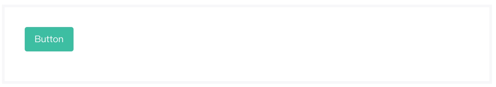
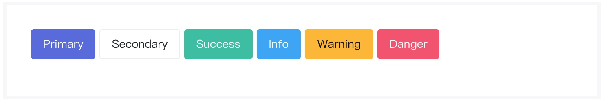
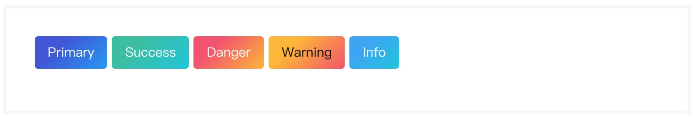
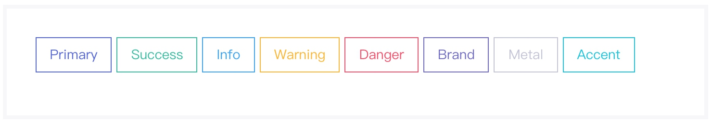
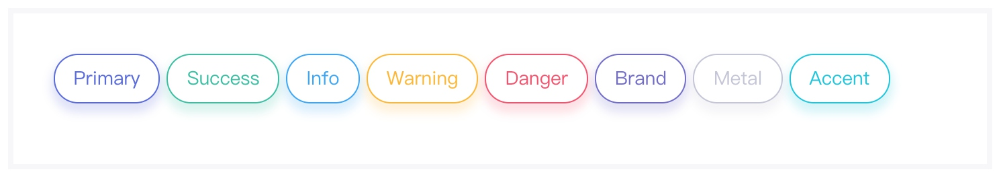
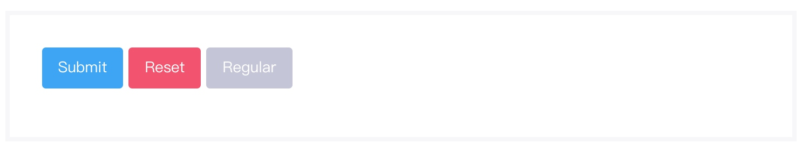
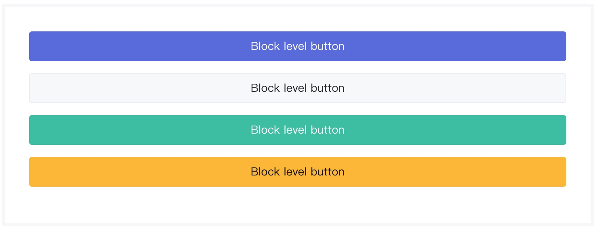
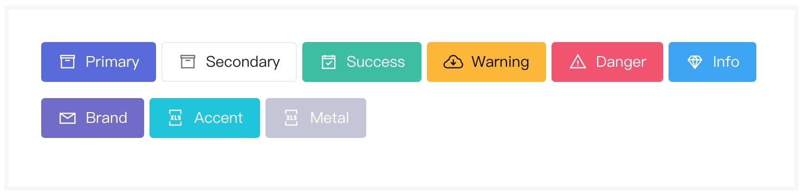
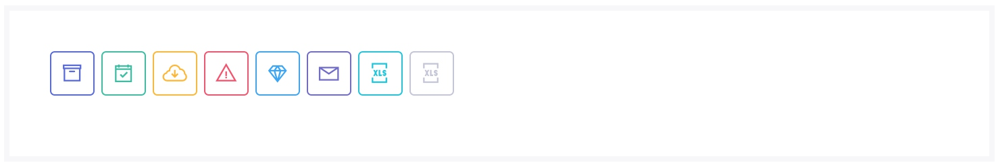

# 基础按钮组件
> 该组件可以在页面中插入单个按钮元素，基础按钮组件是其他按钮组件（下拉按钮组件、按钮组组件等）的基石。

### 作用
基础按钮组件默认为行间组件，它可以根据配置的不同，变化为块级组件。基础按钮组件负责绝大部分页面的交互行为，可以通过基础按钮组件，扩展出众多高级组件。

### 语法
##### 私有参数

| 参数名 | 类型 | 默认值 | 描述
| :-: | :-: | :-: | :- |
| label | string | button | 设置按钮的实现方式，支持的参数有`a`、`button`和`input` 一般情况下，`a` 主要被用于行间展示，`input` 主要在表单中使用，`button` 为通用类型。|
| type | string | button | 设置按钮的操作类型，支持的参数有 `button` 、 `reset` 、`submit`  |
| btnStyle | array | [] | 设置按钮的显示样式，支持的参数有 `square` 、 `pill` 、`air` ，可多选。 |
| size | string | 空 | 设置按钮尺寸。支持的参数有 `sm`、 `lg` 、`regular`  |
| value | string | 空 | 设置按钮显示文本。  |
| icon | object | 空 | 按钮图标设置，配置参数见下方。  |
| fontBold | string | regular | 语法糖，设置按钮文字加粗类型，该属性参考 [状态颜色](../../ch1/stateColor.md)。  |
| btnColor | string | 空 | 设置按钮显示颜色，该属性参考[状态颜色](../../ch1/stateColor.md)，同时支持 `outline` 属性 |
| gradient | object | 空 | 设置按钮渐变颜色，配置参数见下方。该属性与 `btnColor` 属性互斥，且具有较高优先级。 |
| isWide | bool | false | 设置按钮是否加宽显示。  |
| isBlock | bool | false | 设置按钮是否以块级元素渲染。  |
| btnState | string | 空 | 设置按钮当前状态。支持的参数有 `active`、 `disabled` 、`regular`  |
| isCustom | bool | false | 设置按钮是否以扁平化样式显示。  |
| loader | object | 空 | 设置按钮是否显示loader，配置见 [加载组件](../base/loader.md) 。  |
| thicken | bool | false | 设置按钮边框是否加粗，该属性仅在 `btnColor` 属性为 `oulline-[color]` 时生效。  |
| `href` | string | # | 设置按钮的跳转链接，该属性仅 `label` 属性值为 `a` 时生效。 |


icon对象

| 参数名 | 类型  | 描述
| :-: | :-: | :-: | 
| show | bool | 设置按钮是否显示图标。|
| name | string | 设置图标名称。|
>若设置了 `icon` 属性，且按钮的 `value` 属性值不存在，则以` icon-only` 状态显示。

gradient对象

| 参数名 | 类型  | 描述
| :-: | :-: | :-: | 
| from | string | 设置按钮渐变的起始颜色，该属性参考 [状态颜色](../../ch1/stateColor.md)。|
| to | string | 设置按钮的渐变的终止颜色，该属性参考 [状态颜色](../../ch1/stateColor.md)。|

##### 调用方式
``` jsx
import Button from '@Button';
<Button {...{
    value:'Button',
    btnColor:'success'
}}/>
```
##### 渲染结果
``` html
<button class='btn m-btn btn-success'>Button</button>
```
##### 实现效果

### 最佳实践
通过 [公共配置](../ch1/public.md)，组件可以实现丰富的样式和逻辑的控制。

##### 状态颜色
通过 `btnColor` 属性，按钮组件可以设置渲染的颜色，除通用的[状态颜色](../../ch1/stateColor.md)外，按钮组件还支持 `outline-[color]` 颜色。

**代码示例：**
```js
{
    btnColor:'success'
}
```
**实现效果：**
- 通用状态颜色：



-  `outline` 状态颜色：


##### 渐变色
通过设置 `gradient` 对象的 `from` 和 `to` 属性，可以很便捷的从任意[状态颜色](../../ch1/stateColor.md)渐变至其他[状态颜色](../../ch1/stateColor.md)。
> 注意：该属性与 `btnColor` 冲突，若同时存在 `gradient` 和 `btnColor`，优先显示 `gradient` 。

**代码示例：**
```js
{
    gradient:{
        from:'danger',
        to:'warning'
    }
}
```
**实现效果：**


##### 显示样式
按钮组件支持设置一种或多种显示样式，通过 `btnStyle` 属性可以设置显示样式。
- Normal：圆角矩形外观
- Square：尖角矩形外观
- Pill： 环形外观
- Air：阴影外观

**代码示例：**
```js
{
    btnStyle:['pill','air']
}
```
**实现效果：**

Square：

Pill：

Air：

##### 操作类型
在不同的情景下，我们通常会希望按钮有不同的使用类型：
- 在提交表单时，按钮是 Submit 类型。
- 在清空数据时，按钮是 Reset 类型。
- 在进行 Ajax 操作或页面元素控制时，按钮是Button 类型。

按钮组件通过 `type` 属性，可以自由的控制按钮的操作类型。

**代码示例：**
```js
{
    type:'submit'
}
```

**实现效果：**

##### 按钮状态
按钮存在多种状态，通过 btnState 属性可以设置当前按钮的显示状态。
- Active:当前按钮被激活，具有较深的背景颜色显示或反色显示。
- Disabled：当前按钮被禁用，按钮整体变灰，且无法被点击。

**代码示例：**
```js
{
    btnState:'active'
}
```

**实现效果：**


##### 块状按钮
在移动端应用程序上，通常默认的按钮样式无法满足业务需求，可以考虑使用块级按钮，通过 `isBlock` 属性，可以将按钮设置为块状显示。

**代码示例：**
```js
{
    isBlock:true
}
```

**实现效果：**

##### icon按钮
在部分业务需求中，在按钮旁增加一个有意义的按钮，可以让用户更容易理解按钮的含义。通过设置 `icon.show` 的值为` true`，并设置 `icon.name` 的值即可显示 `icon` 。

**代码示例：**
```js
{
    icon:{
        show:true,
        name:'la la-warning'   
     },
     value:'Danger'
}
```

**实现效果：**

##### icon-only
`Icon-only` 是针对图标的特殊样式，是指当设置了 `icon` 属性，并且按钮的 `value` 属性为空时，按钮会以一种特殊的样式显示。

**代码示例：**
```js
{
    icon:{
        show:true,
        name:'la la-warning'   
     },
     value:null //可以直接不设置value，或将value值设置为null。  
}
```

**实现效果：**



