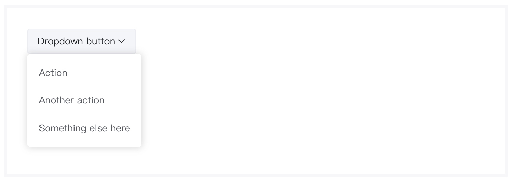
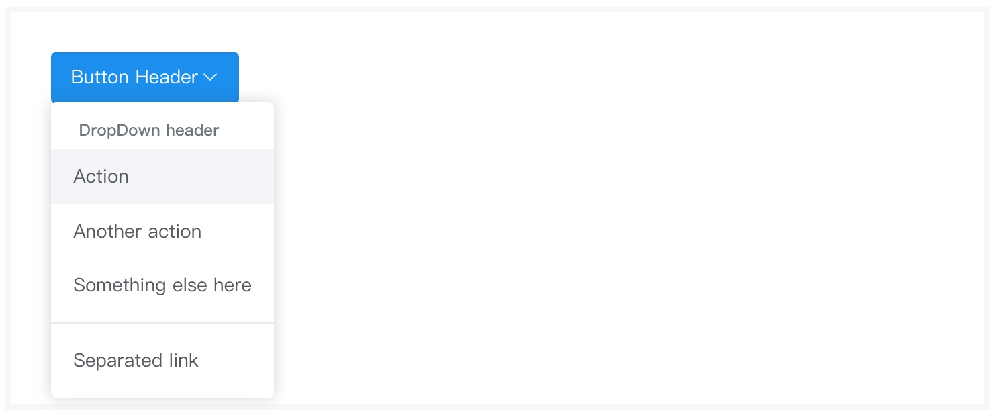

# 下拉按钮组件
> 下拉按钮是由多个按钮组件复合而成。该组件会在页面中生成一个包含一个直接按钮、一个下拉按钮和若干隐藏按钮选项。

### 作用
下拉按钮组件是一种复合的行间组件。下拉按钮组件可以将操作按钮归类在一起，节约页面空间。用户可以直接通过下拉选项进行操作。每个选项均可单独绑定各类事件回调，。

### 语法
##### 私有参数
| 参数名 | 类型 | 默认值 | 描述
| :-: | :-: | :-: | :- |
| button | object | 空 | 设置直接按钮的属性，见下表。  |
| toggle | object | 空 | 设置下拉按钮的属性，见下表。  |
| items | array | [] | 设置下拉选项的属性，见下表。  |
| direction | string | down | 设置下拉选项的打开方向。支持的参数有 `up` 、 `down` 、`left`、`right`   |
| itemAlign | string | left | 设置下拉选项的对齐方式。支持的参数有 `left` 、 `right` 、`center`、`justify`   |

button对象
>button对象的属性完全继承自 [基础按钮组件](./baseButton.md) 。

toggle对象

| 参数名 | 类型  | 描述
| :-: | :-: | :- | 
| show | bool | 设置下拉按钮是否显示。|

>除了 `show` 属性之外， toggle对象的其他属性完全继承自 [基础按钮组件](./baseButton.md) 。

item对象

| 参数名 | 类型  | 描述
| :-: | :-: | :- | 
| type | string | 设置当前选项的类别。支持的参数有 `button` 、`divider`、`header`|
| align | string | 设置当前选项的对齐方式。该配置可以覆盖外部的 `itemAlign` 配置。支持的参数有 `left` 、 `right` 、`center`、`justify` |
>除了 `type` 和 `align` 属性之外，`item` 对象的其他属性完全继承自 [基础按钮组件](./baseButton.md) 。

##### 调用方式
``` jsx
import ButtonDropdown from '@ButtonDropdown';
<ButtonDropdown {...{
    button:{
      value:'Dropdown button',
      btnColor:'secondary'
    },
   items:[
      { value : 'Action'},
      {value:'Another action'},
      {value:'Something else here'}
   ]
}}/>
```
##### 渲染结果
``` html
<div class="btn-group">
    <button class="btn m-btn btn-secondary dropdown-toggle" type="button" data-toggle="dropdown">
        Dropdown button
    </button>
    <div class="dropdown-menu">
        <button class="dropdown-item" type="button">Action</button>
        <button class="dropdown-item" type="button">Another action</button>
        <button class="dropdown-item" type="button">Something else here</button>
    </div>
</div>
```
##### 默认样式



### 最佳实践
通过 [公共配置](../ch1/public.md)，组件可以实现丰富的样式和逻辑的控制。

##### 定义按钮样式
下拉按钮组件是一种复合组件，除了在参数中设置 [公共配置](../ch1/public.md) 以外，还可以在 `button` 、 `toggle`或任意 `item` 中传入[公共配置](../ch1/public.md) 。
```js
{
   button:{
     value:'dropdown button',
     _includeClass:'m-font--success'
  },
  toggle:{
     show:true,
    _includeClass:'m-font--success'
  },
 items:[
    {
      value:'Action',
      _includeClass:'m-font--success'
    }
 ]
}
```

##### 分组和分组标题
如果存在数量较多的下拉项，对下拉项进行分组是一个不错的解决方案，将相似操作归类为同一组并设置标题可以直观的展示给用户。
```js
{
    type:'header' //设置标题
}

{
    type:'divider' //设置分组
}
```

示例：


##### 对齐方式
下拉按钮共有两种设置选项对齐方式，一种是 `itemAlign`，该属性可以一键设置所有选项的对齐方式。另一种是 `item` 的属性 `align` ，该属性可以设置当前 `item` 的对齐方式。

示例:


