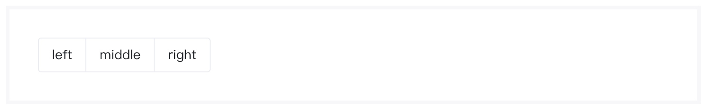
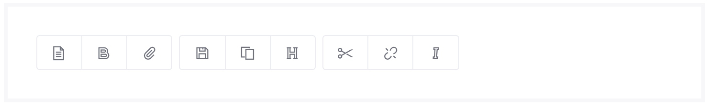
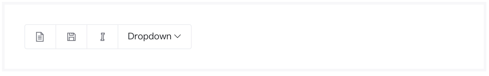

# 按钮组组件
> 按钮组允许多个按钮被堆叠在同一行上。当你想要把按钮对齐在一起时，这就显得非常有用。

### 作用
按钮组组件是一种复合的行间组件。按钮组组件可以将操作按钮归类在一起，以对齐的方式显示。

### 语法
##### 私有参数

| 参数名 | 类型 | 默认值 | 描述
| :-: | :-: | :-: | :- |
| btns | array | [] | 按钮组列表，具体配置参数见下表。|
| size | string | normal | 按钮组整体尺寸，支持的参数有 `lg`、`sm`、`normal`。|
| groupStyle | array/string | 空 | 按钮组显示样式，可多选，支持的参数有 `pill`、`air`、`square`。|
| vertical | bool | false | 按钮组是否以竖排方式显示，支持的参数有 `true`、`false`。|

btns数组对象
> btns是一个对象数组，用于指定按钮组中每个按钮的展示行为，其属性完全继承自 [基础按钮组件](./baseButton.md) 。除此之外，对象还可以包括如下属性。

| 参数名 | 类型  | 描述
| :-: | :-: | :- | 
| type | string | 设置当前选项的类型，支持的参数有`button`、`dropdown`。|
| dropdown | object | 仅type设置为`dropdown`时生效，设置当前下拉按钮组件的属性，参考 [下拉按钮组件](./dropdownButton.md) 。|


##### 调用方式
``` jsx
import ButtonGroup from '@ButtonGroup';
<ButtonGroup {...{
        btns: [
        {
           value: 'left',
           btnColor: 'secondary'
        },
        {
            value: 'middle',
            btnColor: 'secondary'
         },
         {
            value: 'right',
            btnColor: 'secondary'
          }
        ]
 }}/>
```
##### 渲染结果
``` html
<div class="btn-group" role="group">
    <button class="btn m-btn btn-secondary" type="button">left</button>
    <button class="btn m-btn btn-secondary" type="button">middle</button>
    <button class="btn m-btn btn-secondary" type="button">right</button>
</div>
```
##### 默认样式

### 最佳实践
通过 [公共配置](../ch1/public.md)，组件可以实现丰富的样式和逻辑的控制。

##### 定义按钮样式
按钮组组件是一种复合组件，除了在参数中设置 [公共配置](../ch1/public.md) 以外，还可以在 `btns` 任意子元素 中传入[公共配置](../ch1/public.md) 。

**代码示例：**
```js
{
    btns:[
        {
            value:'left',
            _includeClass:'demo-class'
        } ,
        {
            type:'dropdown',
            dropdown:{
                ...,
                _includeClass:'demo-class'
            }
        }   
    ]
}
```

##### toolbar
若需要将多个按钮组合并为一行，可以在按钮组外部添加 `btn-toolbar` 修饰符，多个按钮组将以行间组件并排显示。

**代码示例：**
```jsx
<Div _includeClass='btn-toolbar'>
    <ButtonGroup {...}/>
    <ButtonGroup {...}/>
    <ButtonGroup {...}/>
</Div>
```

**实现效果：**

##### 尺寸
无需为按钮组中每一个按钮添加` size` 属性，只需在按钮组中添加 `size` 属性即可实现不同尺寸的切换。

**代码示例：**
```jsx
{
    btns:[...],
    size:'lg'
}
```

**实现效果：**


##### 与 Dropdown 整合
在部分业务中，有些按钮功能可能是被隐藏，需要触发下拉按钮才会展示。在 `btns` 数组中，传入 type属性为 `dropdown` ，且设置了 `dropdown` 属性的对象即可实现在按钮组中添加下拉按钮。普通按钮和下拉按钮可以混排使用。

**代码示例：**
```jsx
{
    btns:[
        {
            icon:{
                show:true,
                btnColor:'secondary'
                name:'la la-file-text-o'
            }
        },
        ...
        {
            type:'dropdown',
            dropdown:{
                button:{
                    value:'Dropdown',
                    btnColor:'secondary'
                },
                items:[...]
            }
        }
    ]
}
```

**实现效果：**


##### 垂直按钮组
通过设置 `vertical` 属性可以很便捷的将按钮组翻转90°，实现垂直展示。

**代码示例：**
```js
{
    btns:[...],
    vertical:true    
}
```

**实现效果：**

