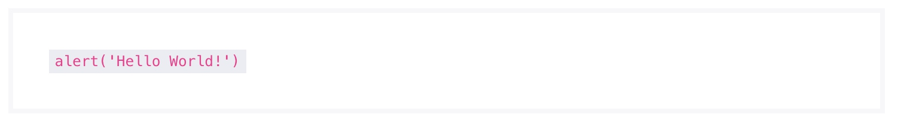

# 代码组件
> 该组件可以在页面中插入一个显示为代码高亮的文本。

### 作用
代码组件为行间组件，仅可以作为代码纯文本内容的容器。代码组件会让代码内容高亮显示。
 
### 语法
##### 调用方式
``` jsx
import Code from '@Code';
<Code>
    alert( 'Hello World!' );
</Code>
```
##### 渲染结果
``` html
<code>
    alert( 'Hello World!' );
</code>
```
##### 实现效果

### 最佳实践
通过 [公共配置](../ch1/public.md)，组件可以实现丰富的样式和逻辑的控制。
##### 子元素
代码组件支持作为其他组件的子元素使用。

**代码示例：**
```jsx
<Text>
    所有HTML的标题,均可以通过<Code>Title</Code>组件实现。
</Text>
```

**实现效果：**

