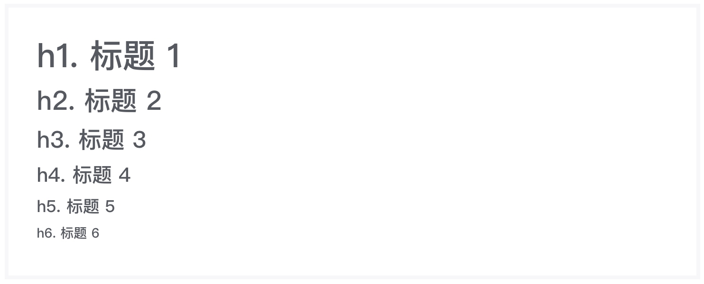

# 标题组件
> 该组件可以在页面中插入一个带样式的文本标题，可以控制标题的显示级别。

### 作用
标题组件为块级组件，表示一个标题。内部可嵌套纯文本内容、行间 DOM 元素或组件。标题共可设置六个等级，分别对应 DOM 元素中的 `h1` ~ `h6` 。
 
### 语法
##### 私有参数

| 参数名 | 类型 | 默认值 | 描述
| :-: | :-: | :-: | :- |
| `level` | number | 1 | 标识标题等级，可选的参数由1到6，分别对应 DOM 元素中 `h1` 到 `h6`。 |

##### 调用方式
``` jsx
import Title from '@Title';
<Title level={1}>
    This is a h1 title.
</Title>
```

##### 渲染结果
``` html
<h1>
    This is a text.
</h1>
```
#####  实现效果



### 最佳实践
通过 [公共配置](../ch1/public.md)，组件可以实现丰富的样式和逻辑的控制。
##### Display类型
这是一种字体更大，更吸引人的标题类型，主要实现内容展示效果。

| 修饰符名 |  描述
| :-: | :- |
| `display-[size]` | 标识标题展示等级，可选的 `size` 参数由1到5，例如 `display-1`。 |

**代码示例：**
```js
{
    _includeClass:'display-1'
}
```

**实现效果：**


##### 其他
标题组件支持与其他行间 DOM 元素或行间组件进行整合，实现更加丰富的效果，以下为与 `small` 元素整合，实现主副标题的简单示例。

**代码示例：**
```jsx
import Title from '@Title';
<Title>
    这是主标题
    <small class='text-muted'>这是副标题</small>
</Title>
```

**实现效果：**

