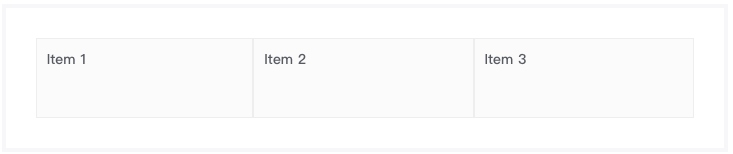

# 栅格系统
> 块级组件，页面布局核心组件，在页面中划分出不同区域，采用 `Flex` 实现，由 `Gid` 组件和 `GridItem` 组件构成。

### 语法
> 栅格系统采用 Flex 布局实现，因此部分概念可以参考 [Flex布局](http://www.runoob.com/w3cnote/flex-grammar.html)

##### 栅格容器（Grid）私有参数
| 参数名 | 类型 | 默认值 | 描述
| :-: | :-: | :-: | :- |
| mode  | string | desktop | 设置当前响应式设备类型，支持的参数有 `desktop`、`desktop-and-tablet`、`tablet`、`tablet-and-mobile`、`mobile` |
| root  | bool | false | 设置当前栅格系统是否为根系统，一般仅在全局配置时设置为 `true`。 |
| direction  | string | ver | 设置当前栅格系统主轴方向，支持的参数有 `ver`、`hor`。 |
| justify  | string | 空 | 设置当前栅格系统主轴上对齐方式，支持的参数有 `flex-start`、`flex-end`、`center`、`space-between`、`space-around`。 |
| wrap  | string | 空 | 设置当前栅格系统主轴换行方式，支持的参数有 `nowrap`、`wrap`、`wrap-reverse`。 |
| alignItems  | string | 空 | 设置当前栅格系统交叉轴上对齐方式，支持的参数有 `flex-start`、`flex-end`、`center`、`baseline`、`stretch`。 |
| alignContent  | string | 空 | 设置当前栅格系统多根轴线对齐方式，如果只有一根轴线，该属性不起作用。支持的参数有 `flex-start`、`flex-end`、`center`、`space-between`、`space-around`、`stretch`。 |

##### 栅格项（GridItem）私有参数
| 参数名 | 类型 | 默认值 | 描述
| :-: | :-: | :-: | :- |
| order  | number | 0 | 设置栅格项的排列顺序。数值越小，排列越靠前，支持的参数有 `0`至`12`的整数。 |
| align  | string | auto | 设置栅格项的允许单个项目有与其他栅格项不一样的对齐方式，可覆盖 `alignItems` 属性。支持的参数有 `flex-start`、`flex-end`、`center`、`baseline`、`stretch`。 |
| fluid  | bool | true | 设置栅格项是否流式布局。 |

##### 调用方式
``` jsx
import {Grid,GridItem} from 'omega';
<Grid {...{
    direction: 'ver'
}}>
    <GridItem {...{
        fluid: true
    }}>Item 1</GridItem>
    <GridItem {...{
        fluid: true
    }}>Item 2</GridItem>
    <GridItem {...{
        fluid: true
    }}>Item 3</GridItem>
</Grid>

```
``` html
<div class="m-grid m-grid--ver">
    <div class="m-grid__item m-grid__item--fluid">Item 1</div>
    <div class="m-grid__item m-grid__item--fluid">Item 2</div>
    <div class="m-grid__item m-grid__item--fluid">Item 3</div>
</div>
```

**实现效果：**



