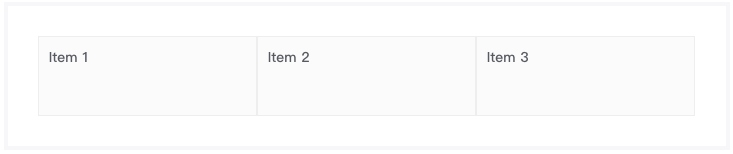

# 内容布局组件
> 块级组件，页面布局核心组件，在页面中划分出不同区域，针对不同区域里内容，设置不同布局方式。

### 语法
##### 私有参数
| 参数名 | 类型 | 默认值 | 描述
| :-: | :-: | :-: | :- |
| direction  | string  | ver  | 设置区域的对齐方式，支持的参数有 `ver`、`hor`。  |
| display  | string  | block  | 设置区域的展示类型，支持的参数有 `block`、`inline`。  |
| mode  | string  | general  | 设置当前设备类型，内容布局组件支持不同设备的不同渲染方案，支持的参数有`general`、`desktop`、`tablet`、`mobile`、`desktop-and-tablet`、`tablet-and-mobile`。  |
| items  | object  | 空  | 配置区域设置，具体参数见下文。  |

##### items配置
| 参数名 | 类型 | 默认值 | 描述
| :-: | :-: | :-: | :- |
| justify  | string  | 空  | 设置内容水平对齐方式，支持的参数有 `left`、`right`、`center`’。  |
| align  | string  | 空  | 设置内容垂直对齐方式，仅 `direction` 为 `ver` 时生效。支持的参数有 `top`、`middle`、`bottom`’。  |
| fluid  | bool  | false  | 设置内容是否流式布局。  |

##### 调用方式
``` jsx
import {Stack} from 'omega';
<Stack {...{
    items: [
        {
            value: 'Item 1'
        }, {
            value: 'Item 2'
        }, {
            value: 'Item 3'
        }
    ],
    _includeClass: 'm-stack--demo'
}}/>

```

##### 渲染结果
``` html
<div class="m-stack m-stack--ver m-stack--general m-stack--demo">
    <div class="m-stack__item">Item 1</div>
    <div class="m-stack__item">Item 2</div>
    <div class="m-stack__item">Item 3</div>
</div>

```

##### 实现效果



